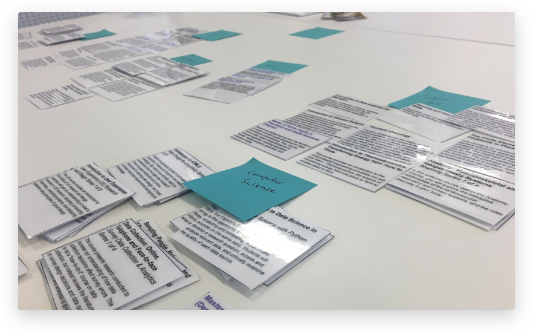
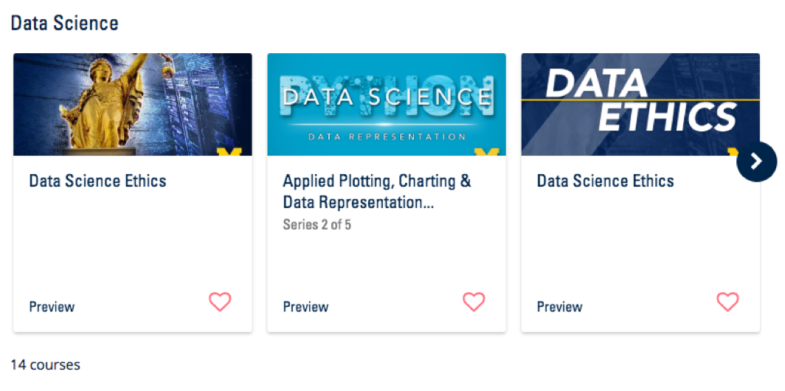
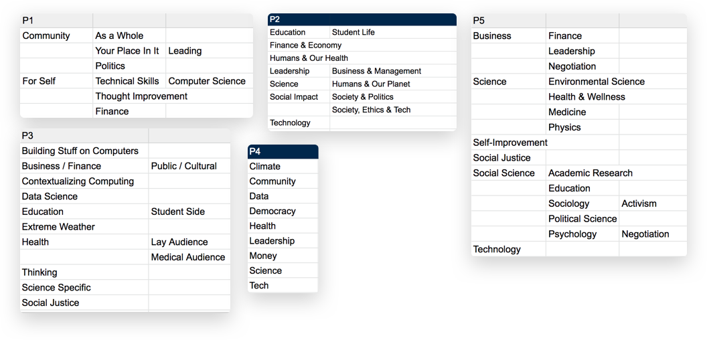
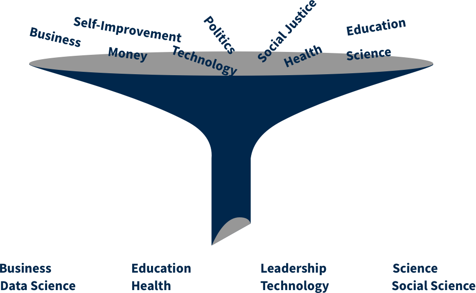
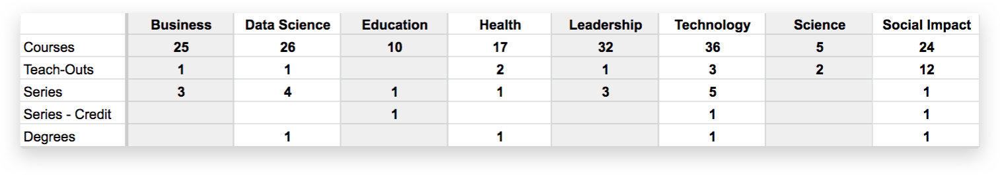
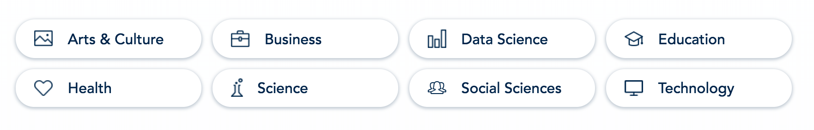

[Michigan Online](/michigan-online/ "Michigan Online") / UX Researcher

# Sorting Out Subjects
How Card Sorting Clarified Our Information Architecture

## Background
Since it launched back in May 2018, Michigan Online has offered over 130 online learning experiences (OLX) to users across a variety of subjects. During that time, the number of “different” subjects reached as high as 14. I say it in that way because Michigan Online populates its OLX data, including subject categories, by automatically syncing with whatever OLX’s we currently have on our partner platforms, Coursera and edX.

 
 

## Known Challenges

Subject-specific content pages were a longstanding goal for the team. Due to time constraints we were unable to include them in the first release of the project. We found a compromise by allowing learners to filter by subject on a “full catalog” page.

Due to Michigan Online’s “downstream” position in the automated data pipeline, and the fact that we partner with multiple platforms to host OLX’s, the site was prone to redundant subjects. One site offered an “Arts & Culture” subjects; the other, “Arts and Humanities.” We knew we already had work to do to eliminate these types of duplications.

Previous user interviews and usability tests of the site confirmed that searching by subject was a common approach for many users. In our second major release, we took what steps we could to support this behavior by creating a page that separated all OLX’s into separate carousels by subject. This was certainly an improvement over the original “filter the full catalog” feature, but still not the ideal solution.

 
 

## The Goal

Subject-specific content pages were a longstanding goal for the team. Due to time constraints we were unable to include them in the first release of the project. We found a compromise by allowing learners to filter by subject on a “full catalog” page.

Due to Michigan Online’s “downstream” position in the automated data pipeline, and the fact that we partner with multiple platforms to host OLX’s, the site was prone to redundant subjects. One site offered an “Arts & Culture” subjects; the other, “Arts and Humanities.” We knew we already had work to do to eliminate these types of duplications.

Previous user interviews and usability tests of the site confirmed that searching by subject was a common approach for many users. In our second major release, we took what steps we could to support this behavior by creating a page that separated all OLX’s into separate carousels by subject. This was certainly an improvement over the original “filter the full catalog” feature, but still not the ideal solution.

 
 

## The Method: Card Sorting

As the lead UX researcher and designer for the project, I advocated for using a card sorting exercise to uncover the appropriate subject category names. I believed this particular method would organically surface the best names in a way that was both quick and comprehensive.

 
 

## Preparation

I started by creating 130+ cards with titles and descriptions of all current courses in our portfolio.", "I then prepared a simple research protocol and scheduled 30-minute sessions with 5 different people in the office. While I could have recruited “real world target users” for this task, I was content to use an internal audience because I believed their opinions and knowledge of the content to be unbiased. I also had limited time to complete this research (about 10 days).

 
 

## Data Collection

During the actual card sorting exercises my role was largely hands-off after I explained how to complete the activity. At the conclusion of each session I noted the names of categories and subcategories each participant created in a spreadsheet. Due to the volume of courses being categorized I stopped at that level of detail.

 
 

## Analysis

After all sessions were completed I was pleased to see a good degree of overlap between the names participants chose, which made it easier to distill the data set into a final set of 8 subjects: Business, Data Science, Education, Health, Leadership, Technology, Science, Social Impact.

 
 

## Validation of Findings

To verify that the chosen taxonomy worked for our content, I applied it to our current OLX portfolio in another spreadsheet. Not only did I note which category a course belonged to, but more importantly, for every subject I noted how many of each OLX type (course, teach-out, series, degree) and the total number of OLX’s it included. This gave us a clear sense of how well the taxonomy mapped onto our content.

 
 

## Final Wordsmithing

After presenting my findings and spreadsheet artefacts to the rest of the team, members of the project’s leadership team proposed a few small adjustments. They felt strongly that the taxonomy should still include an “Arts & Culture” category, and suggested to consolidate “Leadership” courses into the “Business” category. Finally, they proposed to broaden the “Social Impact” category to “Social Sciences,” to allow for more scalability in the future.

 
 

## Results

The final taxonomy consisted of “Arts & Culture”, “Business”, “Data Science”, “Education”, “Health”, “Technology”, “Science” and “Social Science”. One future area of improvement might be to move “Data Science” under “Technology”, as they are very related, but the card sorting results indicated the former to be such a commonly-identified and distinct category that for now it warrants standing on its own.", "You can now find these subjects in active use on the live site!

 
 
